# Integrate and Visualize Your Data in VisualBox

VisualBox is an integration and visualization tool that lets you integrate virtually any data source and visualize the data using reusable widgets. The Managed IoT Cloud AppBoard is great for creating dashboards to visualize data that your devices send to the cloud. However, if you want to customize the look and feel of your graphs and charts, and don't want to spend time learning the API's you can use VisualBox to create dashboards that look exactly the way you want them to. In this document you will:

  * Create a VisualBox account
  * Create a dashboard and integrate with Managed IoT Cloud
  * Add widgets that visualize data

**Disclaimer:** VisualBox is in technology preview, which means that features may be added or removed in the future. It is merely a preview of a tool that will be continously improved over time.

### Contents

  1. Create a VisualBox Account
  2. Create a new Dashboard and Integrate Managed IoT Cloud
  3. Configure Integration
  4. Add Widget and Connect it to Your Data Source

## 1. Create a VisualBox Account

You must first create a new VisualBox account here:

[https://visualbox.io/auth/signup](https://visualbox.io/auth/signup)

A confirmation email will be sent with a link that you must click to verify your email. You will then be able to login.

## 2. Create a new Dashboard and Integrate Managed IoT Cloud

Once you login you will see a list of your dashboards. The list is empty the first time you login so let's create a new dashboard by clicking the "+" button at the top of the dashboard list.

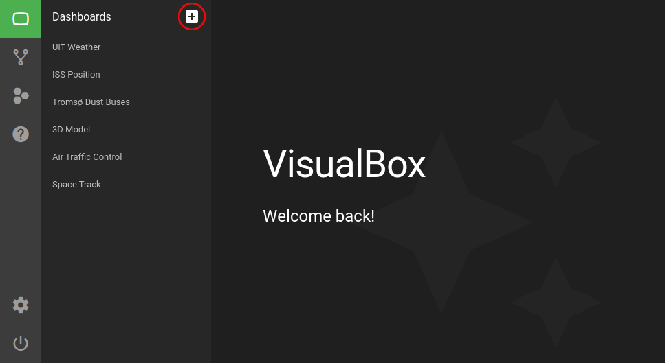

A new dashboard will popup in the list called "New Dashboard". Click the newly created dashboard.

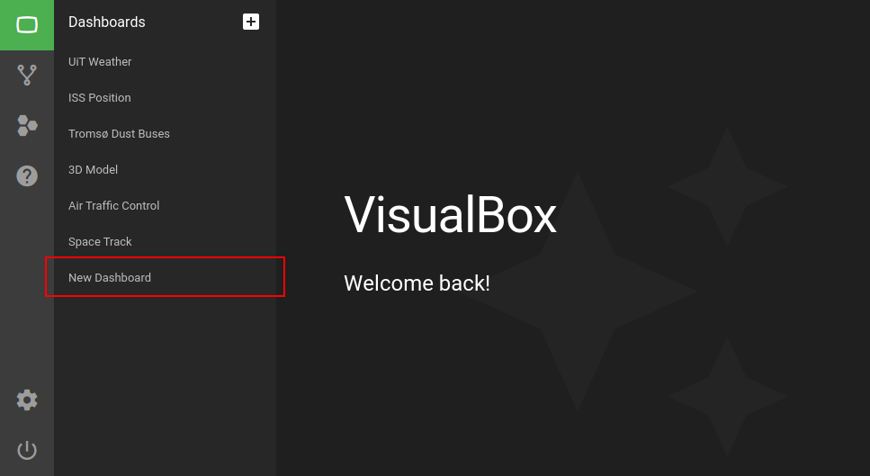

You will now see your new dashboard. To the left you have a panel with three buttons:

  1. Add Integration
  2. Add Widget
  3. Dashboard Settings

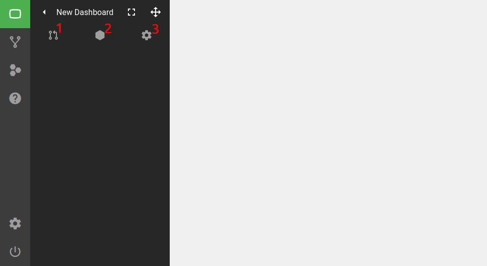

Click the first button to add an integration. An integration browser will open where you can search through public integrations and your own local integrations. For now we will use a public integration called "Managed IoT Cloud - Thing Shadow". Find it in the list and click it:

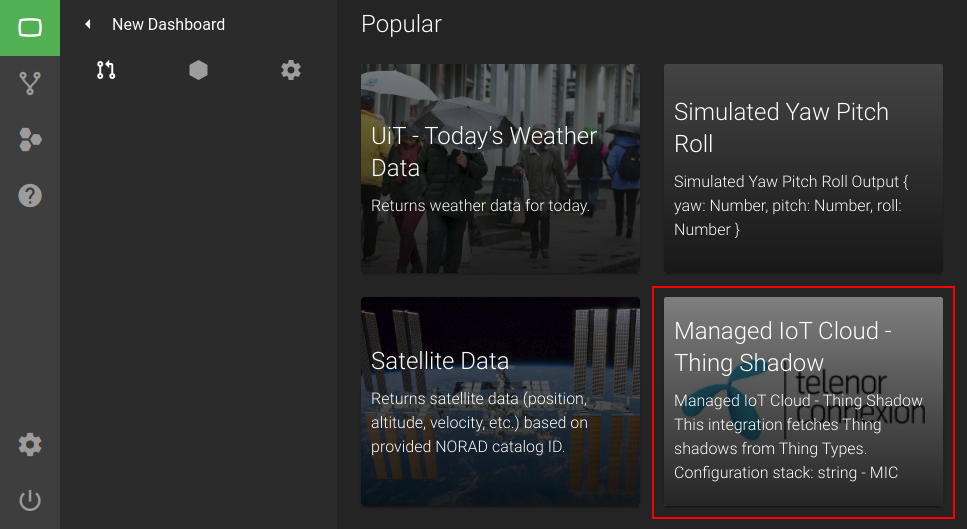

Select the latest version and add it. When using the latest version you are ensured to run the latest code whenever the integration is updated by the maintainer. If you choose a previous version you will stay locked on that version of the integration code, even if the maintainer makes an update.

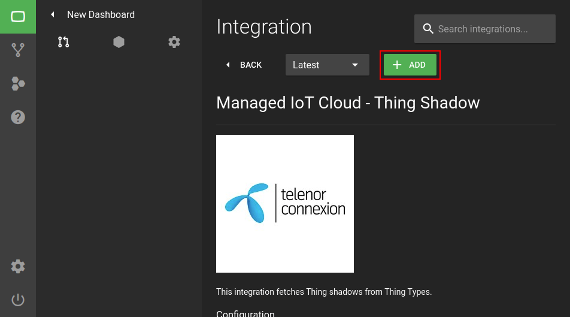

## 3. Configure Integration

After you add the "Managed IoT Cloud - Thing Shadow" integration you will see it go from red to green in the integration list to the left. Once it's green (meaning it has started) click on it to open the configuration menu.

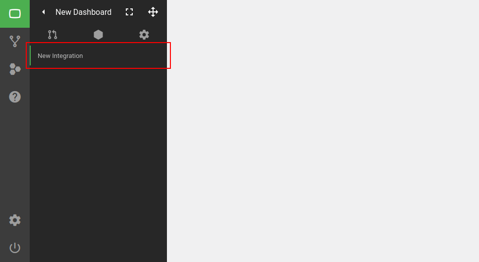

Insert relevant information such as name, Managed IoT Cloud user credentials and desired update interval. You must now find the Thing Type ID for a Thing Type to query. This integration allows multiple Thing Type ID's to be specified by separating them with a comma. After all is done click the "SAVE" button at the bottom.

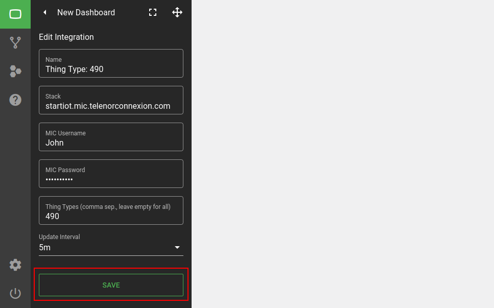

## 4. Add Widget and Connect it to Your Data Source

You must now add a new widget by clicking the second button in the dashboard panel. A widget browser will open where you can search through public widgets and your own local widgets. For now we will use a public widget called "Value Widget". Find it in the list and click it:

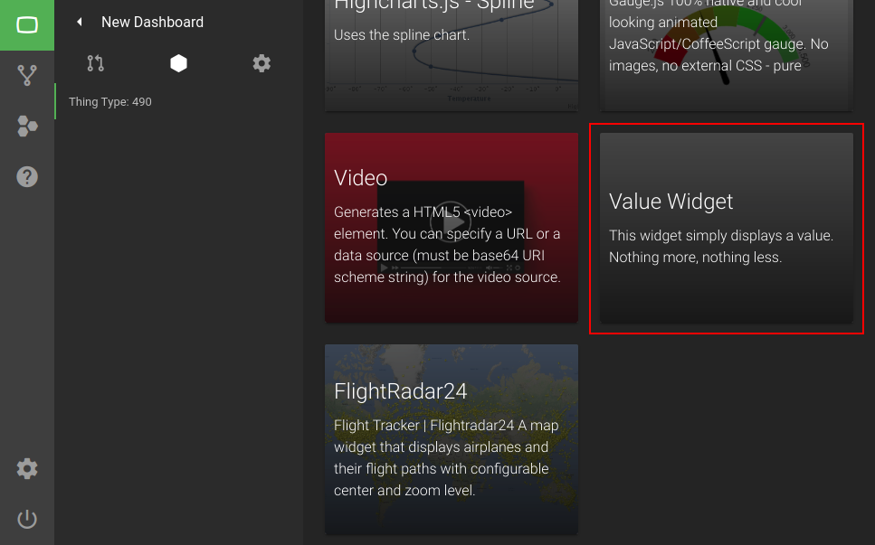

Similarly to when adding an integration we select the latest version to keep the widget code updated when the maintainer makes an update. Click the "+ ADD" button to add the widget to your dashboard:

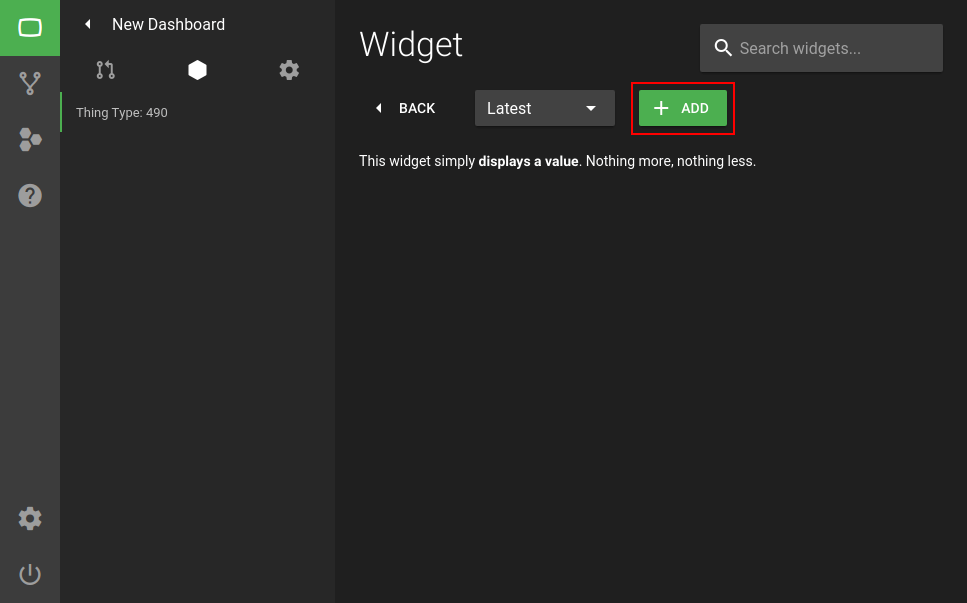

The widget has now appeared in the dashboard. If you hover the widget with your mouse you can see a drop-down menu in the upper right corner. Click on the pencil button to open the widget configuration panel:

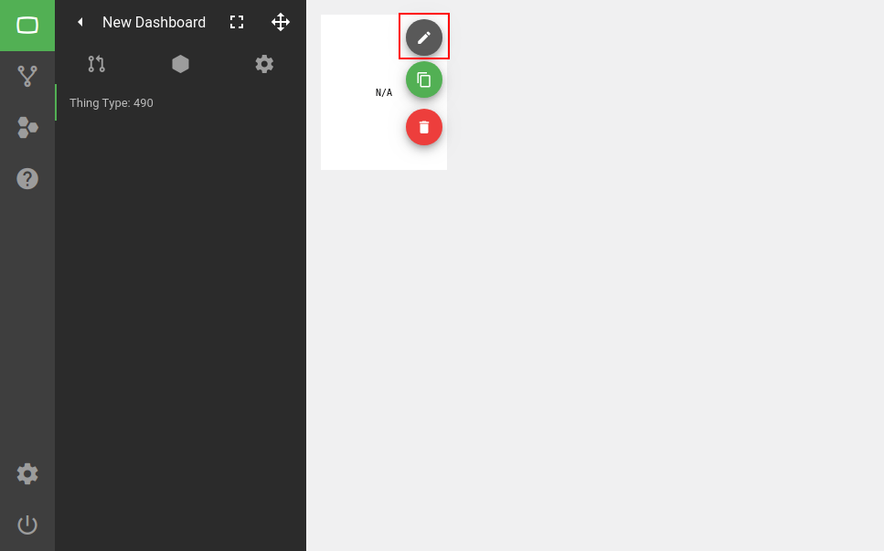

The configuration panel let's you change the look and feel and differs from widget to widget, but they all have the same top button called "Data Source". Click in the top button to open the "data model explorer".

The "data model explorer" shows data produced by the integration we added earlier. The widget in question will only display the value it's provided. Select a node in the data-tree and click "SAVE" in the upper right corner.

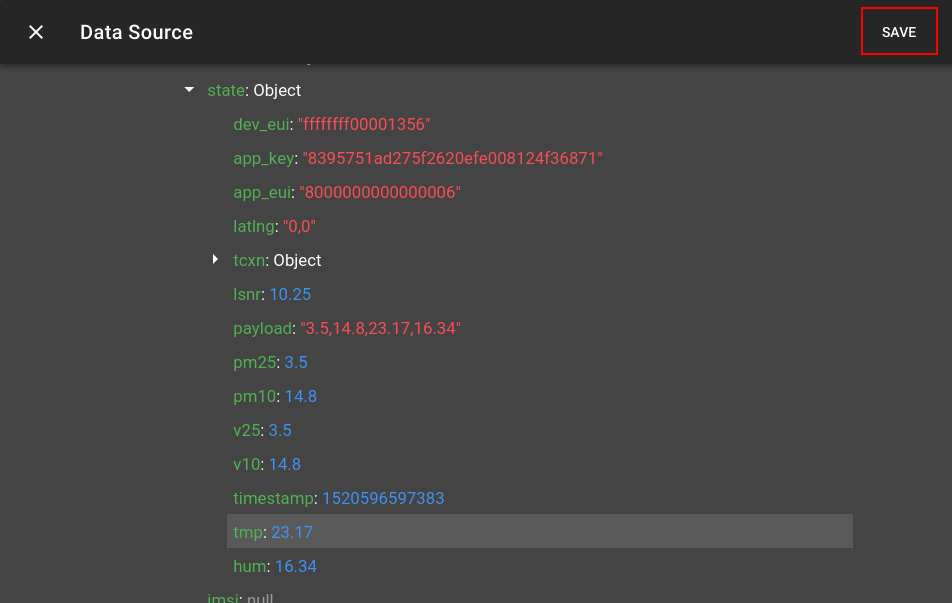

You can now see that the widget shows the value that we selected. You can change the font size and color, give it a title, move it around and resize it (by clicking the move button in the top right panel).

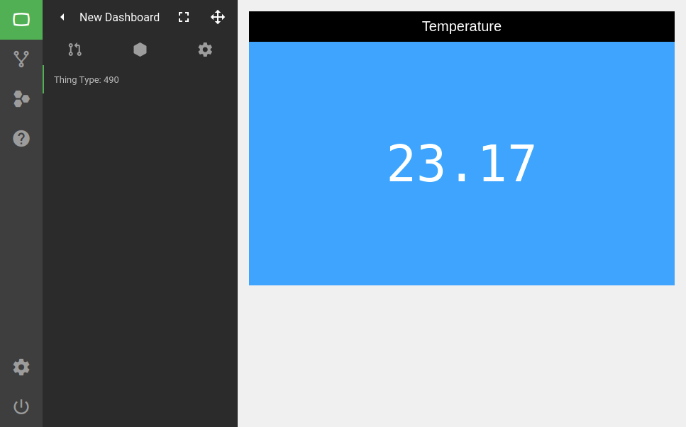

Experiment with different integrations and widget combinations to create interesting and visually appealing dashboards. Once you get a hang of it you can move on to create your own integrations/widgets or fork the code of existing implementations.

Here's a GIF showing how to create a graph widget:

